# DeliveryUY Initial ERD (Entity Relationship Design)

Status: PHASE 00 deliverable (architecture)

Source of truth for modelling rules: `DATABASE.md`.
Modelling decisions: `ADR-008` (money), `ADR-009` (ids, timestamps, soft
delete), `ADR-010` (delivery code), `ADR-011` (idempotency),
`ADR-015` (dispatch), `ADR-016` (testing).

The concrete Prisma proposal derived from this document lives in
`docs/SCHEMA_PROPOSAL.md`. If this document and the proposal ever disagree,
this document is the architectural intent and the proposal is the
implementation detail.

---

## Conventions

- Primary key: `id uuid` (database generated).
- Business code columns (`code`, `reference`) are separate from `id`.
- Money: `numeric(14,2)` + `currency char(3)`.
- Rates/percentages: `numeric(7,4)`.
- Timestamps: `timestamptz`, UTC, `*At` suffix.
- Soft delete: `deletedAt timestamptz null`.
- Append-only ledger/audit tables have no `updatedAt`.
- No cascading deletes on financial/audit records; children are removed only
  when the parent itself is transient.

---

## Domain map

| Domain              | Tables                                                                                                                                 |
| ------------------- | -------------------------------------------------------------------------------------------------------------------------------------- |
| Identity & access   | `User`, `UserRole`, `Session`, `PasswordResetToken`, `VerificationToken`, `CustomerProfile`, `Address`, `Favorite`                          |
| Geography           | `Country`, `City`, `DeliveryZone`                                                                                                        |
| Merchant            | `Merchant`, `MerchantMember`, `MerchantSchedule`, `MerchantClosure`                                                                       |
| Catalog             | `Category`, `Product`, `ProductImage`, `ProductVariant`, `ProductAddon`                                                                  |
| Driver              | `Driver`, `DriverDocument`, `DriverLocation`                                                                                             |
| Cart                | `Cart`, `CartItem` (PHASE 08)                                                                                                           |
| Order               | `Order`, `OrderItem`, `OrderTimeline`, `OrderStatusHistory` (derived from timeline)                                                       |
| Dispatch & delivery | `Delivery`, `DriverAssignment`, `DeliveryCodeAttempt`                                                                                    |
| Payments            | `Payment`, `Refund`, `PaymentWebhookEvent`                                                                                               |
| Financial ledger    | `CommissionRule`, `Commission`, `LedgerAccount`, `JournalEntry`, `LedgerEntry`, `DriverEarning`, `Settlement`, `SettlementItem`            |
| Billing             | `BillingDocument` (PHASE 16)                                                                                                            |
| Promotions          | `Promotion`, `PromotionRedemption`                                                                                                       |
| Ratings & support   | `Rating`, `SupportTicket`, `SupportMessage`, `Dispute`                                                                                   |
| Platform ops        | `AuditLog`, `OutboxEvent`, `IdempotencyKey`, `SystemConfig`, `FeatureFlag`, `RiskEvent`, `WebhookOutbound`, `Notification`, `DeviceSubscription` |

---

## 1. Identity and access

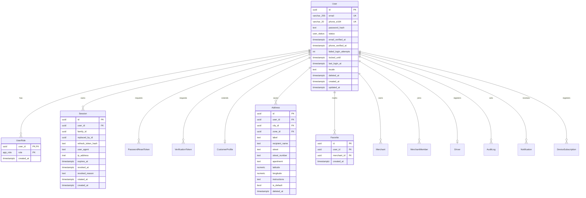

Integrity notes:

- `User.email` is stored lower-cased and is unique among non-deleted users
  (enforced by a functional unique index on `lower(email)`, applied in a raw SQL
  migration - see `docs/SCHEMA_PROPOSAL.md`).
- `Session` rotation: `refresh_token_hash` is a SHA-256 of an opaque random
  token; `family_id` groups a rotation chain; reuse of a rotated token revokes
  the whole family (ADR-002, SECURITY.md).
- `Address.latitude/longitude` are `numeric(9,6)` / `numeric(9,6)` with CHECK
  constraints for valid ranges.

---

## 2. Geography

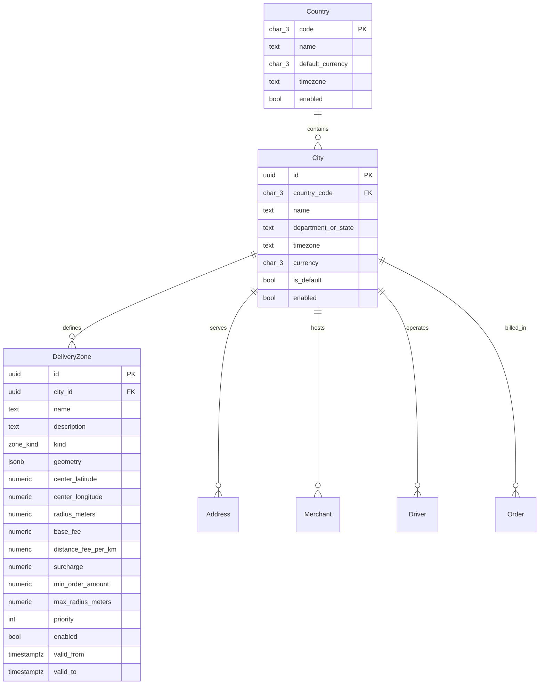

`City` carries timezone and currency so **no city-specific logic is hardcoded**
(AGENTS.md sections 45, 73, 74). PostGIS geometry is added by a later
migration once zone editing requires spatial indexing; `geometry jsonb`
tolerates polygon/radius/neighborhood representations in the meantime.

---

## 3. Merchant

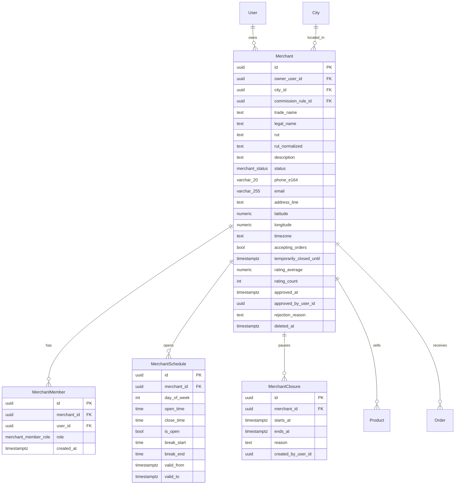

---

## 4. Catalog

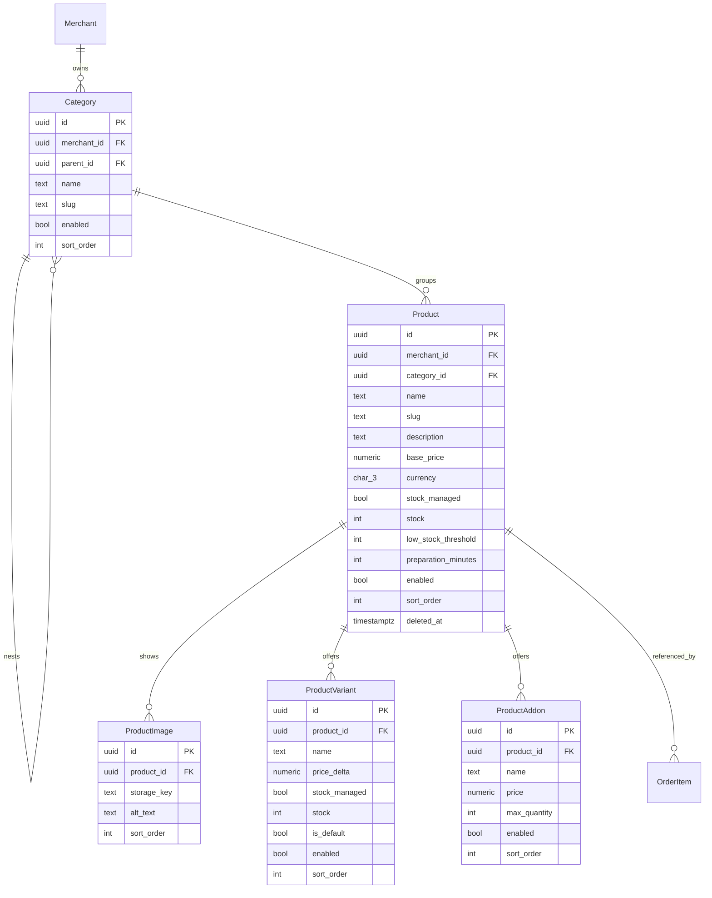

Only `ACTIVE` merchants expose products to customers
(`docs/BUSINESS_RULES.md`). Catalog rows are **never deleted** once ordered;
`OrderItem` snapshots make historical orders independent of these tables.

---

## 5. Driver

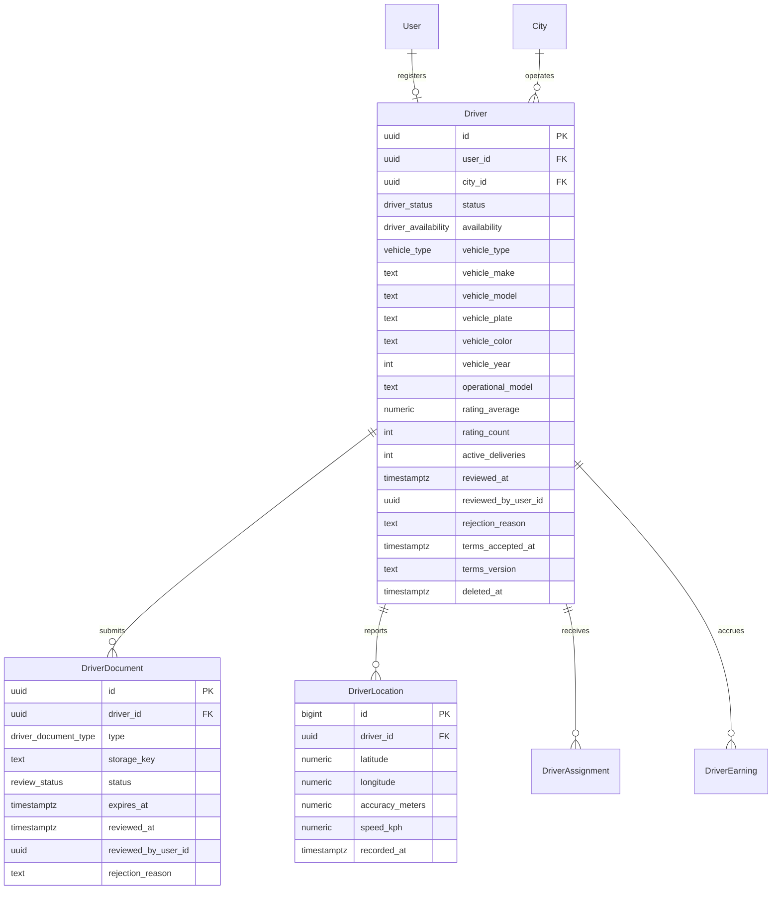

`DriverLocation` is a short-retention operational table (default 24 h, see
ADR-012). Live positions live in Redis. `operational_model` and
`terms_version` exist so ADR-004 (`LEGAL_REVIEW_REQUIRED`) can be resolved by
configuration instead of a schema rewrite.

---

## 6. Cart (PHASE 08)

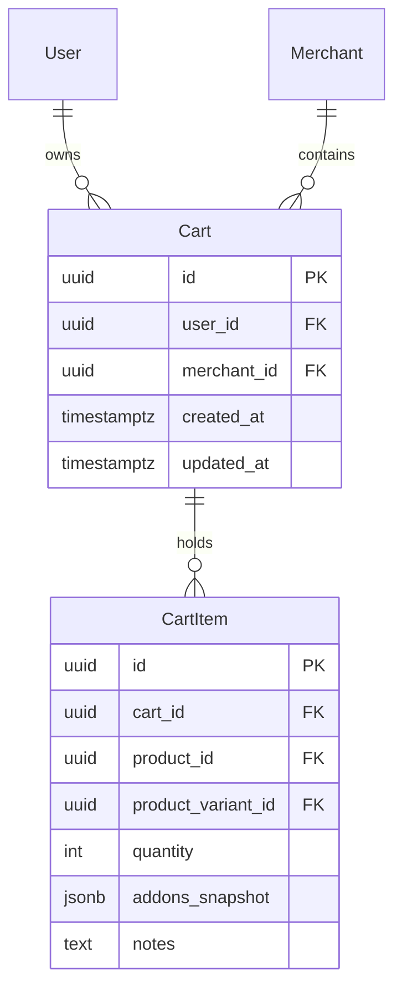

Invariant: at most **one active cart per user per merchant**
(`docs/BUSINESS_RULES.md`), enforced by a partial unique index.

---

## 7. Order

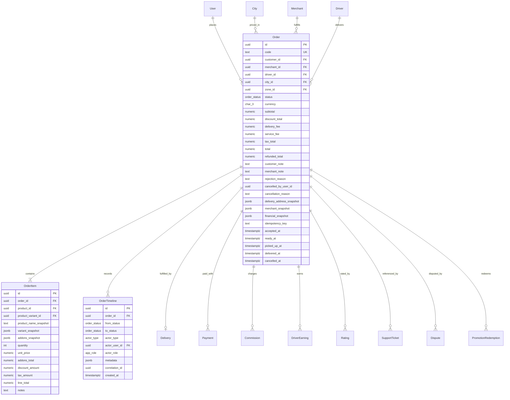

Snapshot rule (AGENTS.md sections 87, 88, 89, `DATABASE.md`):
`OrderItem.*_snapshot`, `Order.delivery_address_snapshot`,
`Order.merchant_snapshot` and `Order.financial_snapshot` are immutable after
`Order.createdAt`. Editing a saved address or a product price must never change
an existing order.

---

## 8. Dispatch and delivery

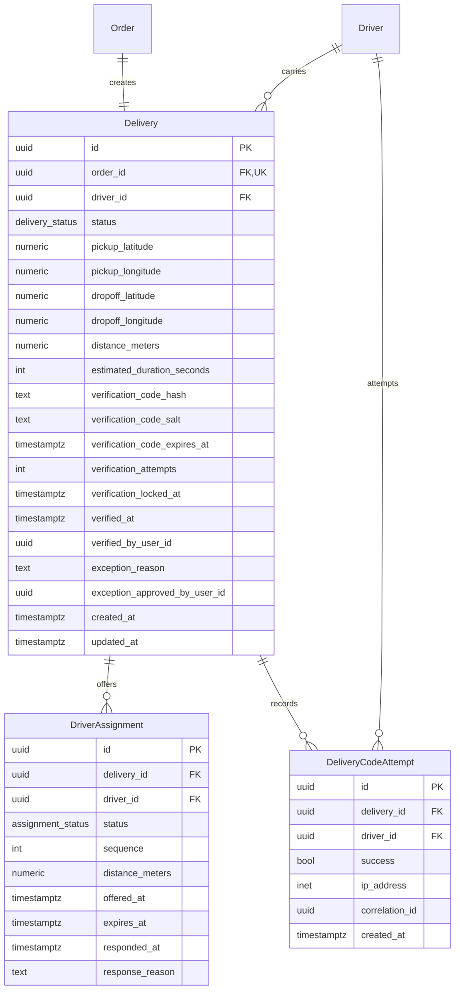

`DriverAssignment` keeps the full offer history (`sequence`, ADR-015,
AGENTS.md section 90). Only one `ACCEPTED` row may exist per delivery, enforced
by a partial unique index.

---

## 9. Payments

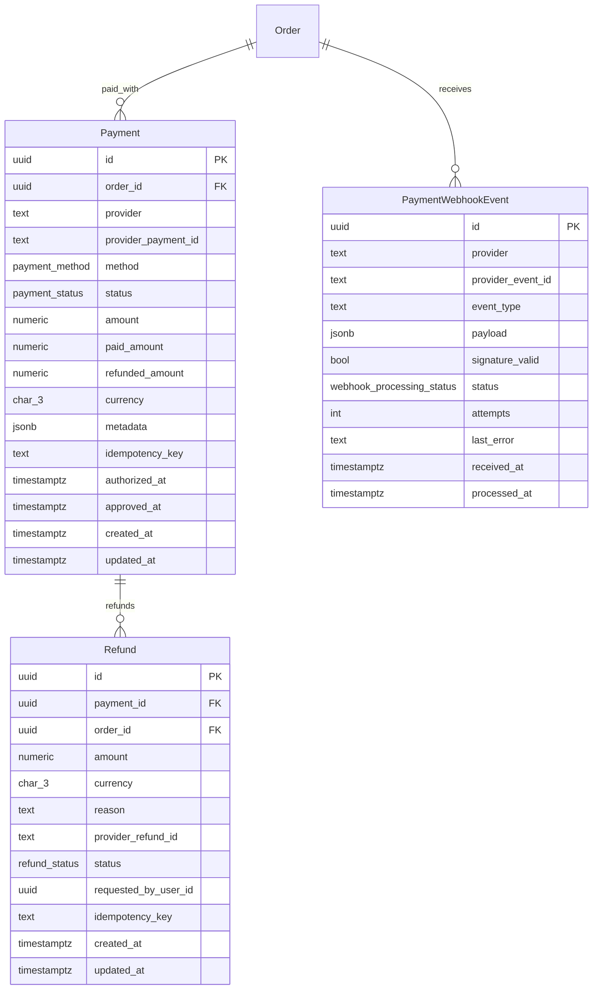

`unique(provider, provider_event_id)` is the webhook idempotency guard
(ADR-011). `Payment.status` is only ever advanced from verified provider
state, never from a client redirect (AGENTS.md section 18).

---

## 10. Financial ledger, commissions and settlements

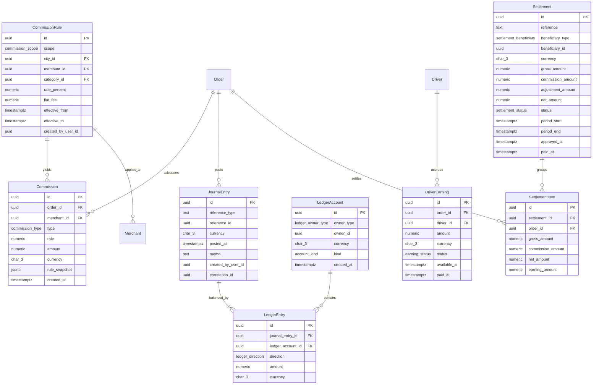

Rules (AGENTS.md sections 20, 21):

- commission rules are resolved by specificity at order time and the resolved
  rule is snapshotted in `Commission.rule_snapshot`;
- a `JournalEntry` must balance: sum(debits) = sum(credits). A PostgreSQL
  deferred constraint trigger enforces this;
- balances are derived from `LedgerEntry`, never stored as mutable counters;
- historical orders are immutable: later commission changes only affect new
  orders.

---

## 11. Promotions, ratings, support

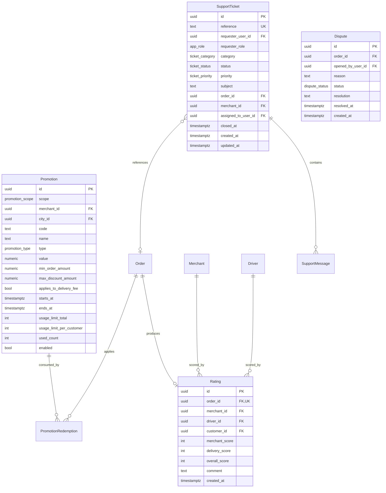

`Rating.order_id` is unique: a customer cannot rate the same order twice, and
the service verifies order ownership and `DELIVERED` status
(AGENTS.md section 49).

---

## 12. Platform operations

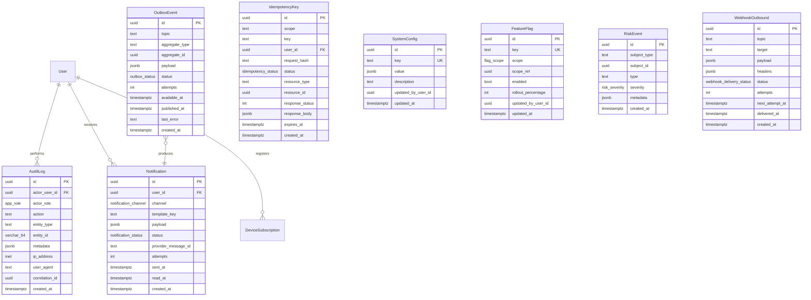

`AuditLog`, `OrderTimeline`, `LedgerEntry`, `PaymentWebhookEvent`,
`DeliveryCodeAttempt` and `RiskEvent` are append-only. `RiskEvent` stores
neutral operational signals only and never asserts fraud
(AGENTS.md section 91).

---

## Cardinality summary

| Parent             | Child              | Cardinality                                | Rule                                                        |
| ------------------ | ------------------ | ------------------------------------------ | ----------------------------------------------------------- |
| User               | Session            | 1:N                                        | hard delete on revoke/expiry                                |
| User               | Merchant           | 1:N                                        | owner retains access even if membership changes             |
| Merchant           | Product            | 1:N                                        | only ACTIVE merchants are customer-visible                  |
| Product            | ProductVariant     | 1:N                                        | exactly one `is_default` variant per product                |
| Order              | OrderItem          | 1:N                                        | snapshot fields immutable                                   |
| Order              | OrderTimeline      | 1:N                                        | append-only, mirrors state machine                          |
| Order              | Delivery           | 1:1                                        | created with the order                                      |
| Delivery           | DriverAssignment   | 1:N                                        | at most one `ACCEPTED`; full offer history kept             |
| Order              | Payment            | 1:N                                        | sum(paid) - sum(refunded) must never exceed `Order.total`   |
| JournalEntry       | LedgerEntry        | 1:N (>=2)                                  | debits = credits per currency                              |
| Order              | Rating             | 1:1                                        | unique(order_id)                                            |
| Settlement         | SettlementItem     | 1:N                                        | items never cross beneficiary or period                    |
| Promotion          | PromotionRedemption| 1:N                                        | usage limits enforced transactionally                       |

---

## Database-enforced integrity (not just application rules)

1. `CHECK` constraints for money precision, coordinate ranges, rating ranges
   (1-5), `day_of_week` (0-6), `quantity > 0`, `attempts >= 0`.
2. `UNIQUE` on `User.email`, `Session.refresh_token_hash`,
   `PaymentWebhookEvent(provider, provider_event_id)`,
   `IdempotencyKey(scope, key)`, `Product(merchant_id, slug)`,
   `Merchant.rut_normalized`, `Rating.order_id`, `Order.code`,
   `Delivery.order_id`, `ProductVariant(product_id, name)`,
   `ProductAddon(product_id, name)`, `Favorite(user_id, merchant_id)`,
   `Driver.user_id`, `CustomerProfile.user_id`.
3. Partial unique indexes: one default variant per product, one `ACCEPTED`
   assignment per delivery, one active cart per user+merchant,
   platform-level category slug uniqueness.
4. `CHECK (quantity > 0)` plus `CHECK (stock >= 0)` for stock-managed items.
5. Deferred constraint trigger enforcing balanced `JournalEntry`.
6. `CHECK` preventing a `User` row from having an `ADMIN` role without a
   non-deleted profile (implemented in application + audit instead of a
   constraint, to avoid schema-level coupling to RBAC).
7. No `ON DELETE CASCADE` from `User`, `Merchant` or `Order` to financial or
   audit tables.

---

## Index plan

| Table                 | Index                                                        | Purpose                                  |
| --------------------- | ------------------------------------------------------------ | ---------------------------------------- |
| User                  | unique(email)                                                | login                                    |
| Session               | (user_id), (family_id), (expires_at)                          | revocation, cleanup                      |
| City / DeliveryZone   | (country_code), (city_id, enabled), (city_id, priority)        | zone resolution                          |
| Merchant              | (city_id, status), (owner_user_id), (status, accepting_orders) | marketplace listing, approval queue      |
| Product               | (merchant_id, category_id, enabled), (merchant_id, slug)       | catalog browsing                        |
| Driver                | (city_id, status, availability)                                | dispatch candidate lookup                |
| DriverLocation        | (driver_id, recorded_at desc)                                 | short-window history                    |
| Order                 | (customer_id, created_at desc), (merchant_id, status, created_at desc), (driver_id, created_at desc), (city_id, created_at desc) | history screens, operations |
| OrderTimeline         | (order_id, created_at)                                        | timeline rendering                      |
| Delivery              | unique(order_id), (driver_id, status)                          | driver job list                          |
| DriverAssignment      | (delivery_id, sequence), (driver_id, status)                   | offer lifecycle                          |
| Payment               | (order_id), unique(provider, provider_payment_id)              | reconciliation                           |
| LedgerEntry           | (ledger_account_id), (journal_entry_id)                        | balance computation                      |
| Settlement            | (beneficiary_type, beneficiary_id, status)                     | payout batches                           |
| Promotion             | (code, enabled), (starts_at, ends_at)                          | promo lookup                             |
| AuditLog              | (entity_type, entity_id, created_at desc), (actor_user_id, created_at desc) | audit investigation   |
| OutboxEvent           | (status, available_at)                                        | worker polling                           |
| IdempotencyKey        | unique(scope, key), (expires_at)                               | replay + cleanup                         |

Cursor pagination for large dynamic datasets uses the `(created_at, id)`
composite ordering so cursors stay stable (AGENTS.md section 55).

---

## Retention

| Data                             | Default retention            | Configurable key           |
| -------------------------------- | ---------------------------- | -------------------------- |
| `DriverLocation`                 | 24 h                         | `GPS_HISTORY_RETENTION`    |
| Live driver position (Redis)     | 120 s TTL                    | `GPS_POSITION_TTL`         |
| `Session` (revoked/expired)      | 30 days after expiry          | `SESSION_RETENTION`        |
| `IdempotencyKey`                 | 7 days (client) / 30 (webhook) | `IDEMPOTENCY_RETENTION`  |
| `OutboxEvent` (published)        | 7 days                       | `OUTBOX_RETENTION`         |
| `AuditLog`, `OrderTimeline`, `LedgerEntry` | per legal requirement | `LEGAL_REVIEW_REQUIRED`    |
| `DriverLocation` history beyond retention | deleted by scheduled job | -                 |

Legal retention windows for financial and audit records are
`LEGAL_REVIEW_REQUIRED` (LEGAL.md).

---

## Open items for later phases

- `BillingDocument` (PHASE 16) - CFE/electronic invoicing, provider neutral.
- `Wallet`, `Tip`, `LoyaltyAccount` - feature-flagged, not designed yet.
- PostGIS geometry column replacing `DeliveryZone.geometry jsonb` once zone
  editing UI exists.
- Partitioning strategy for `Order`, `AuditLog`, `DriverLocation` when volume
  justifies it (evaluate at PHASE 22).